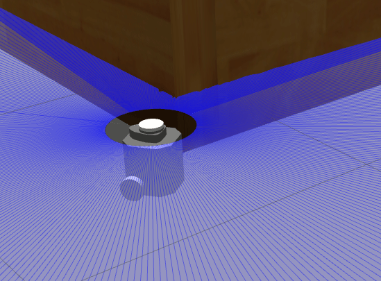

# Turtlebot3 Wallfollower




This repository is my personal project to practice to run turtlebot3 with **ROS 2**.
A turtlebot3 robot follows the wall on the right side based on a simple reactive control with ranging sensory data. The reactive control is implemented with a **Behavior Tree**. (though there is room of improvement in the design...)

## How to Build

Make sure ROS 2 Humble and Gazebo are installed. Then, run the following commands:
```
mkdir -p ~/wall_wc/src
cd ~/wall_wc/src
git clone https://github.com/tidota/turtlebot3_wallfollower.git
cd ..
colcon build
. install/setup.bash
```

## Simulation

Start the simulation.
```
export TURTLEBOT3_MODEL=burger
ros2 launch turtlebot3_wallfollower start_sim.launch.py
```
Then, the robot will be spawned in the simulation environment.

To run the robot, call the `set_running` service.
```
ros2 service call /set_running std_srvs/srv/SetBool 'data: true'
```

To stop it,
```
ros2 service call /set_running std_srvs/srv/SetBool 'data: false'
```

## Actual Robot

Make sure that your turtlebot3 is setup (including `ROS_DOMAIN_ID` and `TURTLEBOT3_MODEL`), and launch the necessary nodes on the robot.
```
ros2 launch turtlebot3_bringup robot.launch.py
```

Then, at the PC side,
```
ros2 launch turtlebot3_wallfollower start_real.launch.py
```

To start,
```
ros2 service call /set_running std_srvs/srv/SetBool 'data: true'
```

To stop,
```
ros2 service call /set_running std_srvs/srv/SetBool 'data: false'
```
