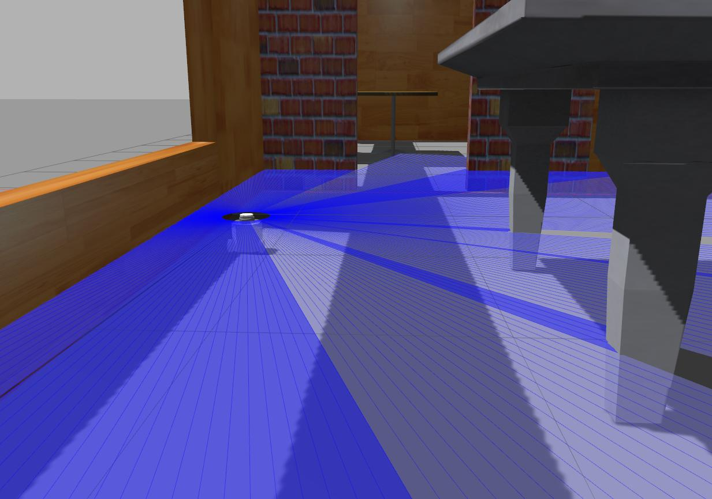
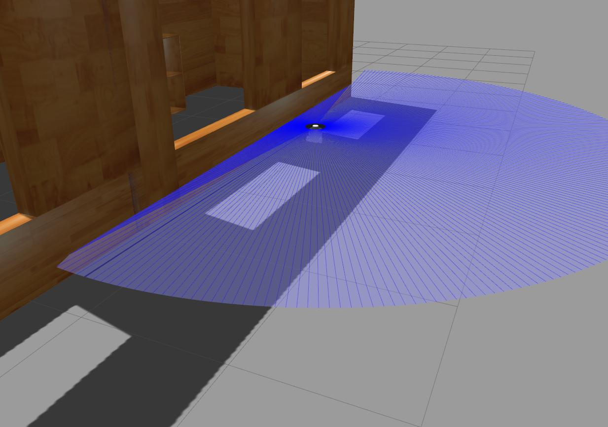

# Turtlebot3 Wallfollower

This repository is a simple wallfollowing program for a turtlebot3.
By using the scan data, a turtlebot3 follows the wall on the right.

It works on both the actual hardware and the simulated one.

## Actual hardware

Assuming the turtlebot3 has been setup, connect to the robot by SSH and launch
the nodes.
```
ros2 launch turtlebot3_bringup robot.launch.py
```

Then, at the local PC,
```
export ROS_DOMAIN_ID=30
ros2 run turtlebot3_wallfollower wallfollower
```

To start,
```
export ROS_DOMAIN_ID=30
ros2 service call /set_running std_srvs/srv/SetBool 'data: true'
```

To stop,
```
export ROS_DOMAIN_ID=30
ros2 service call /set_running std_srvs/srv/SetBool 'data: false'
```

## Simulation





Start the simulation.
```
export TURTLEBOT3_MODEL=burger
ros2 launch turtlebot3_wallfollower start_sim.launch.py
```

To run the robot, call the `set_running` service.
```
ros2 service call /set_running std_srvs/srv/SetBool 'data: true'
```

To stop it,
```
ros2 service call /set_running std_srvs/srv/SetBool 'data: false'
```
